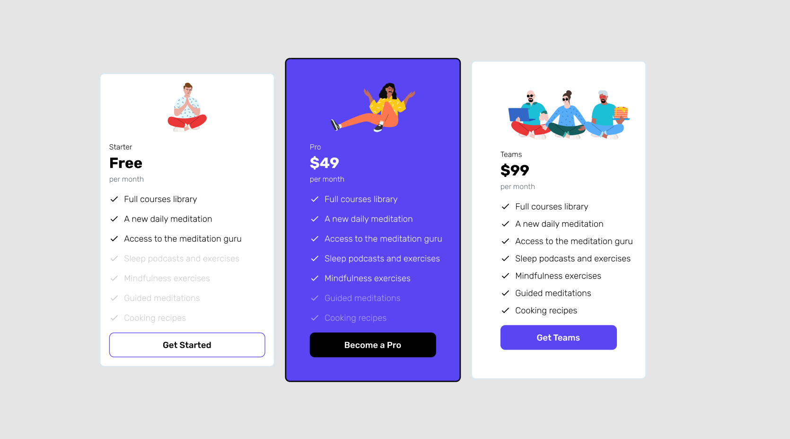
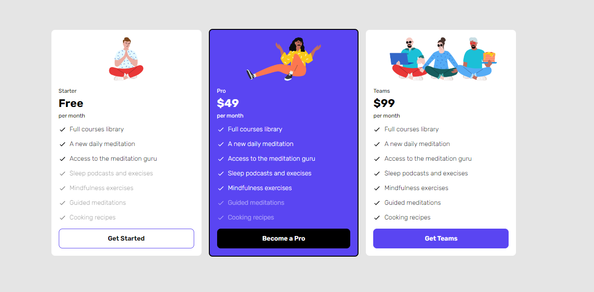

# Jump2Digital - Frontend

> Proyecto realizado para Jump2Digital, organizada por Barcelona Digital Talent. Consiste en un Hackathon donde debes aplicar tus conocimientos de front-end para replicar un mockup de Figma.



*Captura de pantalla del proyecto de Figma en la web https://nuwe.io/*

## Enlace al proyecto desplegado

[Ver en netlify](https://jump2digital-pueyo-mir.netlify.app/) 

## Background

LLeve acabo este proyecto, ya que me parece muy interesante el evento Jump2Digital y quería participar en las diversas actividades que aporta el evento. Respecto al Hackaton, creo que es una buena forma de crear relaciones profesionales, puesto que actualmente estoy buscando empleo de Frontend, por otro lado, este tipo de eventos es algo que me divierte y me motiva a mejorar. 

## Funcionalidad
Se trata de una sola ruta, donde se puede observar tres tipos de suscripción. En cuanto clicas su respectivo CTA se abre un modal, desde este puedes ponerte en contacto ingresando tu email y clicando a enviar.

## API/Components

 ``` shell
├───components
│   ├───Button
│   ├───Form
│   ├───List
│   ├───ModalForm
│   └───PriceCard
├───data
├───pages
│   └───PricePlan
└───theme
    └───scss
        ├───base
        └───utilities
```


- ### Components 
Se ha creado una estructura atomizada para todos los componentes que forman las cartas de suscripciones.

- ### Data
Archivo de Json donde se hay toda la información que imprimirán los componentes. Como se si tratará de una base de datos.

- ### Pages
Layout que combina los diferentes componentes. 

- ### Theme
Estilos globales (scss) para todos los componentes.


## Installation

Este proyecto se inició con la aplicación Create React.

**Scripts disponibles:**

En el directorio del proyecto, puede ejecutar:

### `npm i`
Para obtener todas las dependencias/librerías del proyecto.

### `npm start`
Ejecuta la aplicación en el modo de desarrollo.
Abra http://localhost:3000 para verlo en su navegador.

### `npm run build`
Crea la aplicación para la producción en la carpeta de *build*.
Empaqueta correctamente React en modo de producción y optimiza la compilación para obtener el mejor rendimiento.

La compilación se minimiza y los nombres de archivo incluyen los hashes.
¡Tu aplicación está lista para ser implementada!


## Stack

- SCSS
- HTML
- Javascript
- ReactJS
- JSON

## Roadmap e imágenes



*Captura de pantalla del resultado final del proyecto*

## Información de contacto

1. **Teléfono**: 609 650 420
2. **Email**: [hola@pueyomir.com](mailto:hola@pueyomir.com)
3. **LinkedIn**: [Veure el meu perfil](https://www.linkedin.com/in/pueyojavier) 

## Licencia 

Licencia del proyecto: [MIT](https://opensource.org/licenses/MIT)

